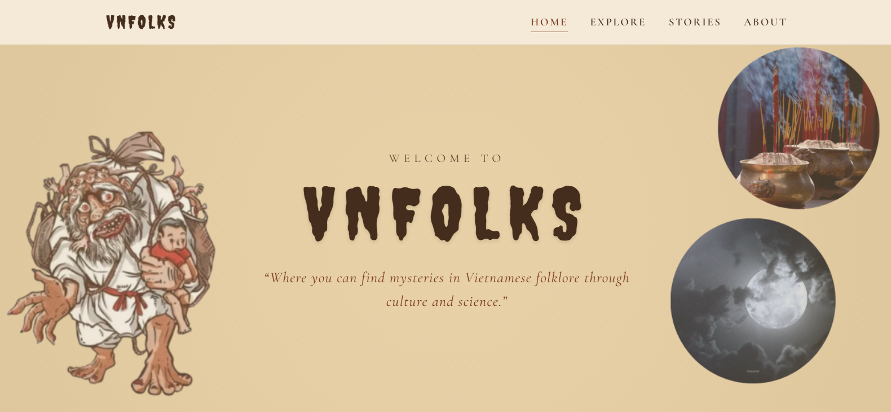
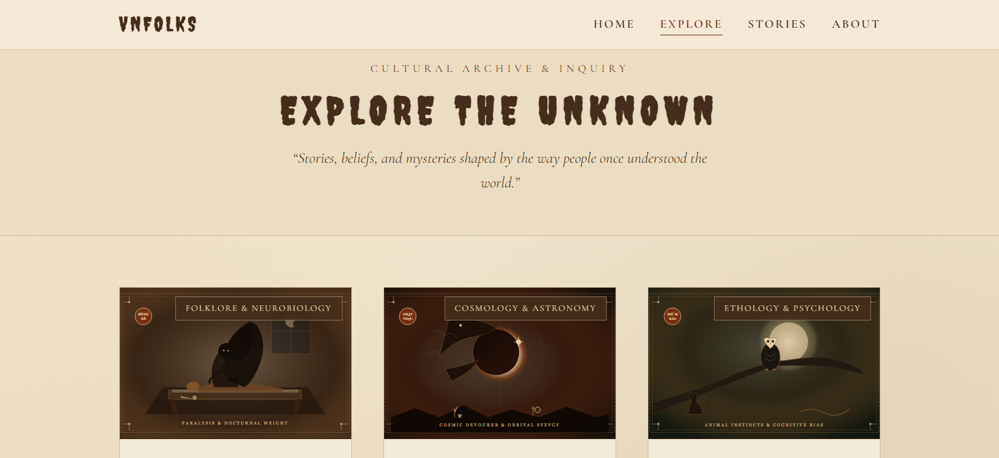

# VNfolks

VNfolks is an English-language digital archive exploring Vietnamese folklore, traditional beliefs, and supernatural legends through both cultural history and modern scientific perspectives.



---

## What VNfolks Is & What It's For

Growing up with Vietnamese culture, I often heard stories about ghosts, bad omens, strange nocturnal creatures, and folk superstitions. While these tales are widely known within Vietnamese households, they are rarely documented in English in an organized way. International audiences—or even younger Vietnamese people living abroad—often miss out on the rich cultural meaning behind them, or only see them flattened into sensationalized horror tropes.

At the same time, people often treat folklore as a binary: either believing in spirits literally, or dismissing old beliefs as foolish superstition. 

I created VNfolks to address both of these issues:
1. **Making Vietnamese folklore accessible in English** so anyone interested in Vietnamese heritage and storytelling can discover these legends.
2. **Exploring the human context behind the stories** using a "folklore first, context second" philosophy. Rather than trying to prove or debunk anything, VNfolks places the oral tradition side-by-side with what history, anthropology, and modern science (like neurology or meteorology) can explain about why our ancestors understood their world this way.

---

## Live Demo & How to Use

### Live Website
You can visit and explore the deployed website at:
**[https://vnfolk.vercel.app/](https://vnfolk.vercel.app/)**

### How to Navigate the Project
The website is divided into four main sections:
- **Home (`index.html`)**: An introduction to the archive's purpose, cultural background, and core philosophy.
- **Explore (`explore.html`)**: Broader cultural topics and phenomena (such as sleep paralysis, animal omens, and eclipses), pairing the traditional folk belief with scientific and historical explanations.
- **Stories (`stories.html`)**: A bestiary of individual folk figures, specters, and ghost stories categorized by theme.
- **About (`about.html`)**: A deeper dive into the ideas guiding VNfolks—why the archive exists, how culture and science complement each other, and how these stories were passed down.

### Key Interactions
- **Reading Dossiers (Modal View)**: Clicking on any topic card on the Explore or Stories page opens a full-screen reading dossier containing the complete folklore narrative, regional origins, cultural meaning, modern context, and citations. You can close this modal by clicking the close button, clicking the backdrop, or pressing the `Escape` key on your keyboard.
- **Story Category Filters**: On the Stories page, you can use the category filter bar at the top to filter stories by theme (*All Legends*, *Warnings & Guardians*, *Spirits & The Dead*, *Rituals & Divination*, and *Nature & Felines*).
- **Mobile Navigation**: On smaller screens, click the hamburger menu icon in the header to open the slide-out navigation drawer.

### Running Locally
Because VNfolks is built with standard web technologies without external dependencies or build steps, you can run it directly on your machine:

```bash
# 1. Clone the repository
git clone https://github.com/your-username/VNFOLKS.git

# 2. Navigate to the project folder
cd VNFOLKS

# 3. Open index.html in your browser directly, or run a simple local server:
# Using Python:
python -m http.server 8000

# Or using Node:
npx serve .
```
Then open `http://localhost:8000` (or the port shown in your terminal) in any modern browser.

---

## Features I Built

- **Dual-Perspective Topic Archive (Explore Section)**:
  Examines 6 major cultural phenomena through folklore and modern knowledge:
  - *Bóng Đè*: Sleep paralysis in Vietnamese folklore paired with REM atonia and hypnagogic hallucination neurobiology.
  - *Solar & Lunar Eclipses*: Ancient sky-eating monster myths alongside orbital mechanics and Rayleigh scattering.
  - *Animal Omens*: Beliefs around barn owls and howling dogs paired with animal sensory biology and cognitive confirmation bias.
  - *Hungry Ghosts & Wandering Souls*: The Seventh Lunar Month offerings explored through historical collective grief and social cohesion.
  - *Astronomy in Vietnamese Mythology*: The Bronze Drum starburst and Weaver/Cowherd tales connected to monsoon meteorology and stellar navigation.
  - *Tết Nguyên Đán*: Protective bamboo *Cây Nêu* and new year taboos examined through domestic sanitation, agricultural timing, and the "fresh start effect."

- **Folklore & Specter Bestiary (Stories Section)**:
  Documents traditional stories and figures with regional context:
  - *Ông Ba Bị*: The three-sacked boogeyman used as a cautionary warning for children wandering near rural waterways.
  - *Ma Đói*: Wandering hungry ghosts denied ancestral resting places.
  - *Ma Lon*: A mid-20th-century youth divination ritual and game of tag with a possessed tin can.
  - *Vietnamese Vampire (Phi Phông)*: The indigenous highland legend from Northwestern Vietnam of living villagers afflicted with a nighttime spiritual ailment (contrasting sharply with European gothic vampires).
  - *Quỷ Nhập Tràng*: Folk accounts of corpse reanimation and its roots in post-mortem spasms and wake rituals.
  - *Ma Xó*: Protective tutelary spirits kept in dark domestic corners of highland stilt houses.
  - *Ma Da*: River specters linked to the hydrological realities of river whirlpools and undertows.
  - *Linh Miêu*: Folkloric black cats believed to sense spirits and conduct static electricity.

- **Interactive Reading Modal System**:
  A custom vanilla JavaScript modal engine that dynamically loads content from a structured data store (`js/archive-data.js`). Includes keyboard accessibility (`Esc` to close), background scroll locking, and semantic formatting.

- **Real-Time Category Filtering**:
  Filter buttons on the Stories page that let readers instantly sort through legends based on themes without reloading the page.

- **Atmospheric Dual-Themed Design System**:
  Built from scratch using CSS variables:
  - Warm parchment styling on Home, Explore, and About to evoke old manuscripts and field notebooks.
  - Dark archive styling on Stories to fit nocturnal bestiary legends.
  - Fully responsive typography and layouts for mobile, tablet, and desktop screens.

- **No-Script & Accessible Fallbacks**:
  Includes semantic HTML structure and fallback card layouts so the core content remains readable even if JavaScript is disabled.

---

## How I Developed the Project

### 1. Research & Content Curation
Before writing any code, I spent significant time gathering and cross-referencing Vietnamese folklore sources. Many of these stories exist primarily in Vietnamese print books, old ethnographic records, or family oral traditions. 
- For the folklore and cultural context, I consulted classical Vietnamese works such as Phan Kế Bính's *Việt Nam Phong Tục* (1915), Nguyễn Đổng Chi's *Kho tàng truyện cổ tích Việt Nam*, Toan Ánh's cultural series (*Phong Tục Việt Nam*, *Nếp Cũ*), and 18th-century chronicles like Lê Quý Đôn's *Kiến văn tiểu lục*.
- For the scientific and analytical context, I researched medical and academic publications (such as sleep medicine papers on REM sleep atonia for *Bóng Đè*, and NASA publications for eclipses) to explain the physical or psychological mechanisms behind what people experienced.
- I translated and adapted these accounts into clear, engaging English, aiming to preserve their cultural respect while making them understandable to readers unfamiliar with Vietnamese customs.

### 2. Architecture & Data Organization
I chose to build VNfolks using pure **HTML5, CSS3, and Vanilla JavaScript** without heavy frontend frameworks like React or Vue. Because VNfolks is primarily a reading and discovery experience, a lightweight static architecture keeps the website fast, simple to maintain, and accessible on any device without large build bundles.

To manage the content cleanly:
- I separated the data layer into `js/archive-data.js`, structuring each article as a JavaScript object with dedicated fields for the folklore legend, cultural origins, scientific context, and source citations.
- In `js/main.js`, I wrote custom functions to render cards dynamically, listen for filter changes, and format modal content safely using a lightweight sanitizing and formatting helper (`formatDossierContent`).

### 3. UI & Visual System
I wanted the website to feel atmospheric and thoughtful rather than like a generic modern corporate template:
- I designed a custom palette using CSS custom properties—warm parchment tones (`#F4EAD8`), toasted caramel (`#84592B`), spiced wine (`#743014`), and deep obsidian (`#1B110A`).
- For typography, I paired Google Fonts to create distinct atmospheres: *Creepster* for eerie display accents, *Cormorant Garamond* for titles and headers, and *EB Garamond* for comfortable, readable body paragraphs.
- I implemented a responsive mobile drawer, smooth transitions, and a modal system with accessible focus and keyboard behavior.

### 4. Challenges & What I Learned
- **Balancing Science and Respect**: One of the biggest challenges was making sure the "What Science Says" sections never sounded arrogant or dismissive. Ancient communities weren't foolish; they were observing real natural phenomena (undertows, sleep paralysis, seasonal rains) without modern tools. Explaining the biology or physics behind a phenomenon actually highlights how observant those ancestors were.
- **Handling Content in Pure JavaScript**: Since I didn't use a framework, writing clean code to dynamically inject HTML, handle modal states, prevent background scrolling, and handle keyboard shortcuts gave me a much deeper understanding of the native DOM and browser events.

---

## Tech Stack

- **HTML5**: Semantic markup across four pages (`index.html`, `explore.html`, `stories.html`, `about.html`).
- **CSS3**: Custom design tokens (CSS variables), responsive Grid and Flexbox layouts, media queries, and dual light/dark themes.
- **Vanilla JavaScript (ES6+)**: Custom dynamic rendering, category filtering, and modal dialogue system in `js/main.js` and `js/archive-data.js` with zero runtime dependencies.
- **Google Fonts**: Serving web typography (*Creepster*, *Cormorant Garamond*, *EB Garamond*).
- **Vercel**: Static site deployment and continuous hosting.

---

## Fonts

Typography on VNfolks is imported via [Google Fonts](https://fonts.google.com/):
- **Creepster**: Atmospheric display font used for eerie title accents.
- **Cormorant Garamond**: Traditional serif font used for page titles, headers, and section tags.
- **EB Garamond**: Serif font used for body text, story narratives, and reading dossiers.

---

## Sources & References

The project relies on documented research, classical folklore literature, and scientific references:

### Cultural & Historical Sources
- **Phan Kế Bính** (1915) — *Việt Nam Phong Tục*
- **Nguyễn Đổng Chi** (1957, 1965) — *Lược khảo về thần thoại Việt Nam* and *Kho tàng truyện cổ tích Việt Nam*
- **Toan Ánh** (1968, 1969, 1974) — *Phong Tục Việt Nam*, *Nếp Cũ: Tín Ngưỡng Việt Nam*, and *Nếp Cũ: Hội Hè Đình Đám*
- **Nguyễn Du** (c. 1800) — *Văn Chiêu Hồn*
- **Lê Quý Đôn** (1777) — *Kiến văn tiểu lục* (records of Northwestern highland lore and early accounts of *ma cà rồng*)
- **Hà Văn Tấn** (1994) — *Văn hóa Đông Sơn ở Việt Nam* (Bronze Drum iconography and solar motifs)
- **Nguyễn Từ Chi** (1996) — *Góp phần nghiên cứu văn hóa và tộc người*
- **Léopold Cadière** (1958) — *Croyances et pratiques religieuses des Viêtnamiens* (EFEO)

### Scientific & Educational References
- **American Academy of Sleep Medicine (AASM)** — *International Classification of Sleep Disorders* (REM atonia and sleep paralysis mechanisms)
- **Sharpless, B. A., & Doghramji, K. E.** (2015) — *Sleep Paralysis: Historical, Psychological, and Medical Perspectives* (Oxford University Press)
- **NASA Eclipse Web Site** — Planetary Geodynamics Laboratory (mechanics of solar and lunar eclipses)
- **Taylor, I.** (2004) — *Barn Owls: Predator-Prey Relationships and Conservation* (Cambridge University Press)
- **Miklósi, Á.** (2015) — *Dog Behaviour, Evolution, and Cognition* (Oxford University Press)
- **Kelley, D. H., & Milone, E. F.** (2011) — *Exploring Ancient Skies: A Survey of Ancient and Cultural Astronomy* (Springer)
- **Dai, H., Milkman, K. L., & Riis, J.** (2014) — *The Fresh Start Effect: Temporal Landmarks Motivate Aspirational Behavior* (*Management Science*)

---

It's a small personal project built out of curiosity, and I hope it helps make Vietnamese folklore and culture a little easier for people everywhere to discover and appreciate.
