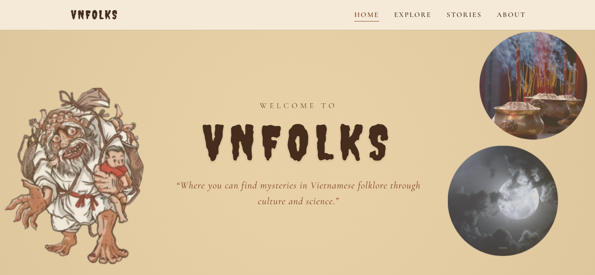

# VN FOLKS

### Welcome to VN FOLKS, an interactive digital archive exploring Vietnamese folklore, cultural traditions, supernatural legends, and real-world science.

I deployed it at: **[https://vnfolk.vercel.app/](https://vnfolk.vercel.app/)**

###  Features:
- **The Four Lenses:** Examine supernatural stories through Oral Folklore, Historical Context, Human Perception, and Modern Science.
- **Folklore Archive & Stories:** In-depth articles on iconic tales like *Bóng Đè*, *Solar & Lunar Eclipses*, *Ông Ba Bị*, *Ma Đói*, and *Ma Lôn*.
- **Vintage Paper Aesthetic:** Custom parchment-style design paired with clean monochrome framing and typography.
- **Interactive Modals:** Clickable archive cards that open rich, detailed story pop-ups.
- **Smart Navbar:** Smooth navigation detecting page sections cleanly.

### Built with:
- HTML5
- CSS3 
- JavaScript 

### About the project 💭
Living in Vietnam—and Asia more broadly—I grew up hearing countless oral folktales from my grandparents, and I drew inspiration from those stories to create this website as a way to tell people about my culture.

I built **VN FOLKS** to explore front-end web development while preserving Vietnamese cultural storytelling. Instead of a generic portfolio, I wanted to create an immersive digital archive that connects traditional folklore with modern scientific explanations. 
Hope you enjoy it!